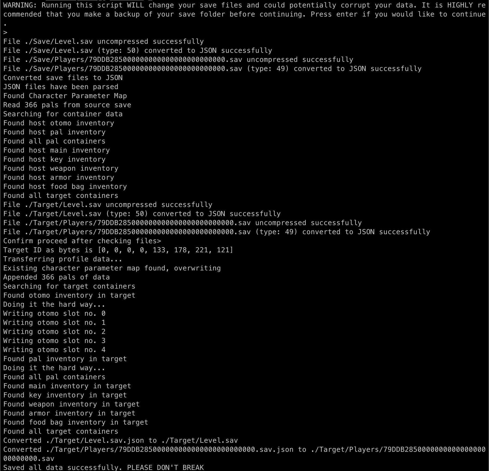

## Some scripts to bootstrap a Palworld Server on Ubuntu
- Tested on 22.04 x64 LTS
- A preview of the Flask Web Controller


## Paltool Example Usage
```
# put source save in Save/ , Destination save in Target/ (Including Level.sav and Players/xxx.sav)
python3 char-export.py ./uesave . 79DDB285000000000000000000000000 79DDB285000000000000000000000000
```
